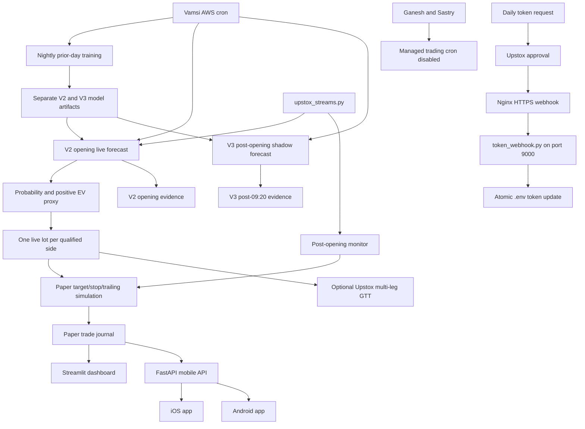

# Hare Krishna Trading Bot: Architecture and Project Handoff

Last updated: 2026-08-14 IST
Repository: `git@github.com:vkp2498-spec/trading-app.git`  
Primary branch: `main`

## 1. Purpose of this document

This is the durable handoff for the trading project developed through the original Codex conversation on the Mac mini. It records the current architecture, strategy decisions, deployment model, operating procedures, important incidents, retired experiments, and the reasoning that shaped the system.

It is intentionally not a raw chat transcript. The source conversation contains many intermediate ideas, temporary fixes, obsolete settings, copied logs, and credentials-adjacent operational details. This document condenses that history into an engineering source of context that can be read on a new computer or in a new Codex task.

Never add API keys, access tokens, webhook secrets, APNs private keys, Android keystore passwords, or production `.env` contents to this document or Git.

## 2. Current project state

The project is an experimental automated trading platform for Indian markets using Upstox. As of 2026-08-14, the only scheduled decision engine is `ML_SHADOW_V1`:

- A shared Python codebase deployed to three AWS Lightsail Ubuntu instances.
- Vamsi runs the opening V2 model live with one lot per independently qualified direction, while post-opening V3 remains forecast-only for comparison.
- Ganesh and Sastry have all managed trading schedules disabled.
- V2 live execution requires `ENABLE_LIVE_TRADING=true`, `ML_SHADOW_LIVE_TRADING_ENABLED=true`, and `ML_SHADOW_V2_LIVE_ENABLED=true`. V3 is forced to shadow by `ML_SHADOW_FORECAST_ONLY=true`.
- The former Vamsi/Ganesh engine remains in the repository only as historical rollback/reference code and is not scheduled.
- Nightly point-in-time training uses about two years (504 sessions) of five-minute data through the previous trading day. The completed 09:15–09:20 candle is observable input; labels use only the subsequent path through 13:15.
- V2 qualifies above 50% probability only when `probability × reward/risk − (1 − probability)` is at least `+0.10R`; the same proxy is recalculated using remaining reward/risk immediately before execution.
- V3 predicts whether a fixed 0.10% directional barrier beats the opposite barrier, plus favorable and adverse post-09:20 excursions. Its qualified signals are recorded without opening broker or paper positions.
- NIFTY percentage levels are converted to ATM option-premium trigger prices using live option delta. Paper execution mirrors target, stop, and step trailing behavior; live execution delegates all three legs to Upstox GTT.
- A Streamlit web dashboard.
- A FastAPI mobile backend used by iOS and Android clients.
- Daily Upstox notifier-token automation through a webhook.
- Upstox Plus streaming and market-information integration.
- Post-market reviews, forensic analysis, score follow-through audits, and historical replay tools.
- A safe utility for resetting dashboard/mobile tracking while preserving configuration and credentials.

Historical research has not established a stable profitable edge. The current engine is evidence collection only; it must not be promoted to live trading from an attractive backtest or a small shadow sample.

## 3. Source-of-truth order

When this document and the implementation differ, use this order:

1. Current code on `main`.
2. Effective account-specific `.env` on the relevant AWS instance.
3. Broker positions/orders and local runtime state.
4. Automated tests and generated data.
5. This handoff document.
6. Historical conversation notes.

The AWS `.env` files are deliberately not in Git, so account behavior can differ even when both instances run the same commit.

## 4. High-level architecture



## 5. Repository map

### Live trading and strategy

- `ml_shadow_4h_v2_live.py`: Live opening V2 trainer/scanner with the `+0.10R` probability-adjusted payoff filter.
- `ml_shadow_v1.py`: Post-opening V3 trainer/scanner, 09:15–09:20 observation features, forecast-only evidence, shared live-state monitoring, and 13:15 exits.
- `trade_bot.py`: Main orchestration, entry dispatch, broker execution, persistent state, live monitor, exits, square-off, and shared safety controls.
- `strategy_core.py`: Upstox option-chain access, expiry selection, option recommendations, and directional signal construction.
- `market_technicals.py`: 5-minute, 15-minute, and 2-hour technical analysis, pivots, Bollinger Bands, moving averages, momentum, and option-premium level conversion.
- `signal_score.py`: Weighted signal alignment.
- `unified_entry_score.py`: Versioned 100-point Vamsi entry score combining signal evidence with the former market-strategy gates.
- `live_trade_filters.py`: Market regime, entry structure, reward/risk, extension, and invalidation filters.
- `portfolio_risk.py`: Aggregate risk, day-level circuit breakers, and correlation checks.
- `institutional_flow.py`: Futures/OI, nearby option flow, VIX, FII/DII, PCR, max pain, and persistence context.
- `banknifty_breadth.py`: Major-bank breadth for BANKNIFTY.
- `nifty_breadth.py`: NIFTY constituent and heavyweight breadth.
- `market_information.py`: Upstox Plus market-information data and caching.
- `ganesh_gap_reversal.py`: Pure functions for Ganesh's opening-gap reversal strategy.
- `option_chain_trend.py`: Persistent option-chain trend snapshots.

### Streaming, broker, and persistence

- `upstox_streams.py`: Market and portfolio stream service and cache files.
- `upstox-streams.service.example`: Example systemd unit.
- `safe_storage.py`: Locked and atomic state/file operations.
- `trade_journal.py`: Executed trade journal.
- `analysis_journal.py`: Signal analysis records.
- `scan_journal.py`: Concise scan decisions and score history.
- `trade_history_schema.py`: Trade-history schema normalization.
- `merge_trade_history.py`: Safe merging and deduplication of trade history.
- `sync_upstox_today_trades.py`: Broker-to-local reconciliation aid.
- `manual_index_trade.py`: Controlled manual index-option entry integrated with bot monitoring.

### Dashboard and mobile

- `performance_dashboard.py`: Streamlit performance and research dashboard.
- `dashboard_data.py`: Shared dashboard/mobile payload construction and state aggregation.
- `mobile_api.py`: FastAPI mobile dashboard, trading configuration, screener, and order endpoints.
- `mobile_orders.py`: Mobile delivery-order operations.
- `trading_config.py`: Mobile-selected capital profile and dynamically scaled risk settings.
- `apns_push.py`: Apple push notifications.
- `stock_screener.py`: Weekly delivery-stock research screener.
- `aws_control.py`: Restricted AWS-side control helpers.

### Authentication

- `request_upstox_token.py`: Sends the daily Upstox token approval request.
- `token_webhook.py`: Validates the notifier webhook and atomically updates `.env`.

### Research and diagnostics

- `post_market_review.py`: Post-market review and loss analysis.
- `post_market_score_audit.py`: Score-bucket follow-through audit.
- `adaptive_score_calibration.py`: Pre-market Vamsi score-rule calibration from stored follow-through evidence.
- `banknifty_post_market.py`: BANKNIFTY veto/technical follow-through study.
- `trade_forensics.py`: Executed and rejected signal excursion analysis.
- `session_insights.py`: Session-level observations.
- `counterfactual_replay.py`: Counterfactual decision replay.
- `strategy_replay.py`, `run_strategy_replay.py`: Historical strategy replay.
- `backtest_data.py`, `backtest_report.py`: Historical data and reporting helpers.
- `ml_v2_simulator.py`, `ml_v2_simulator_app.py`: Local 18-month/6-month V2 holdout simulator with RR-cutoff comparisons and explicit fixed-premium/delta assumptions.
- `check_pnl.py`: Quick P&L reporting.

### Operations

- `.env.example`: Canonical documented configuration. It contains no secrets.
- `reset_tracking_data.py`: Archives and resets dashboard/mobile trading statistics.
- `reset_trading_config.py`: Resets the mobile capital profile to its configured default.
- `requirements.txt`: Python dependencies.
- `test_*.py`: Unit and regression tests.

Some legacy modules remain for historical compatibility or research. Their presence does not mean that their strategy is active.

## 6. Strategy engine selection

Each AWS instance selects one entry engine:

```dotenv
TRADING_ENGINE=VAMSI
```

or:

```dotenv
TRADING_ENGINE=GANESH
```

Only the selected engine may create new entries. The monitor and square-off layers always inspect every known bot state slot. This is important: changing the selected engine must not orphan a position created by the other engine.

Current state slots include the Vamsi NIFTY/BANKNIFTY lanes, legacy compatibility slots, and the Ganesh `GANESH_GAP_NIFTY` / `GANESH_GAP_BANKNIFTY` lanes.

## 7. Vamsi engine

### 7.1 Intent

The Vamsi engine is the evolved multi-signal intraday long-option engine. Its primary instruments are NIFTY and BANKNIFTY call/put options. It combines market structure, option-chain evidence, option-premium flow, breadth, and institutional context before constructing an entry.

### 7.2 Main evidence families

- Option-chain direction and confidence.
- 5-minute and 15-minute completed-candle trend and momentum.
- 2-hour higher-timeframe context.
- Classic pivots.
- Bollinger upper/lower bands and middle-band moving average.
- ATM or selected-option VWAP, slope, volume ratio, spread, and Greeks.
- NIFTY constituent breadth or BANKNIFTY major-bank breadth.
- Futures price/OI behavior, basis, VIX, FII/DII context, PCR, and max pain.
- Market regime and entry structure.
- Reachable technical reward/risk and entry extension.
- Portfolio risk, daily risk, position correlation, broker state, and monitor health.

The live Vamsi entry decision uses one versioned score, `VAMSI_UNIFIED_ENTRY_V1`. Its weights total 100: core option/technical alignment 25, multi-timeframe direction and entry structure 25, breadth 20, institutional context 10, market regime/expiry 10, and trade feasibility (15-minute target, reward/risk, and entry extension) 10. These market-strategy conditions no longer veto a setup separately; alignment earns points and conflict or weak evidence earns fewer points. The score is an evidence ranking, not a calibrated probability.

Liquidity/contract validity, broker reconciliation, monitor health, market hours, duplicate-position controls, capital/lot ceilings, broker protection, and portfolio risk remain hard execution safeguards. Post-fill technical validation is observation-only: it records revised reward/risk and target context but cannot flatten a filled position.

When `VAMSI_ADAPTIVE_SCORE_ENABLED=true`, the 09:00 IST job analyzes only prior rows tagged with the current unified score version, separately for NIFTY and BANKNIFTY. It compares minimum-and-above rules with contiguous bounded ranges and saves the effective rule in `data/vamsi_adaptive_score_config.json`. Legacy weighted-score observations remain stored but are excluded because their scale is not comparable. Until at least 20 current-version observations exist across five trading days, or whenever today's calibration is missing/stale/invalid, the strict fallback is `score > VAMSI_UNIFIED_SCORE_FALLBACK` (default 55). Adaptive boundaries are inclusive.

For a manually selected static score range, set `VAMSI_ADAPTIVE_SCORE_ENABLED=false`, use `VAMSI_UNIFIED_SCORE_FALLBACK` as the inclusive lower boundary, and set the optional `VAMSI_UNIFIED_SCORE_MAXIMUM` as the inclusive upper boundary. If the maximum is omitted, the legacy strict minimum-only rule remains in effect.

For multiple disjoint static bands, set `VAMSI_UNIFIED_SCORE_RANGES` to comma-separated inclusive ranges such as `50-59,80-89`. An explicit multi-range setting takes precedence over adaptive calibration and over the fallback/maximum pair; scores in gaps between bands are rejected.

The post-market audit stores up to 60 one-minute OHLC candles for every selected unified-score observation. Dashboard presentation consistently groups scores as 0-9, 10-19, through 90-100 so low-score paper observations remain visible. The adaptive engine retains its finer internal research cells independently of these display buckets. The 09:00 job first keeps the score-band exit report in `data/vamsi_adaptive_exit_shadow.json`, then builds `data/vamsi_adaptive_live_policy.json` across the dashboard's time and score cells. A cell needs at least 40 within-cell non-overlapping observations across ten trading days, chronological held-out positive conservative expectancy, held-out profit factor of at least 1.20, and three successful calibrations containing new evidence. Target/stop optimization resolves same-candle ambiguity as a stop and limits changes to 10% per calibration.

The Time × Score Net P&L matrix on the main dashboard is intentionally today-only and has no historical date selector. Cumulative and historical results belong in the Analytics section.

Before any cell completes promotion, the static 65-69 and 11:00-13:55 collection strategy remains active while scans across 09:15-15:25 populate every research cell. After first promotion, only `LIVE_ENABLED` cells may enter; the policy supplies that cell's score band and target/stop. The daily live-trade allowance is the number of distinct promoted time cells capped by `VAMSI_ADAPTIVE_MAX_LIVE_TRADES_CAP` (default two). A missing, stale, incompatible, or failed policy after first promotion suspends adaptive entries instead of returning to the static rule. The policy is generated from prior dates and remains immutable intraday.

### 7.3 Contract selection

- NIFTY deliberately separates evidence from execution: nearest-expiry ATM
  option-chain, OI/PCR, VWAP, volume, and trend data drive the analysis. On
  Wednesday, the day after the normal Tuesday expiry, execution uses that new
  front/same-week ATM contract. From Thursday through Tuesday, execution uses
  the following NIFTY expiry.
- Ganesh uses the same NIFTY expiry split. In FAITHFUL mode the nearest-expiry
  evidence is recorded as context without silently adding a new entry veto.
- BANKNIFTY continues to analyze and execute the configured nearest contract.
- Non-NIFTY contract comparison can include suitable ATM and nearby one-strike-ITM contracts when enabled.
- Both candidates must pass hard spread/Greek/depth validity checks. Structure and feasibility contribute to the unified score.
- Capital allocation is converted into whole lots and rounded down.
- `ACCOUNT_MAX_OPTION_CAPITAL` and `ACCOUNT_MAX_LOTS_PER_ENTRY` remain hard account ceilings.
- NIFTY uses the front expiry only on Wednesday; every other session uses the
  following expiry to reduce near-expiry distortion. Confirm the exact current
  selection in `strategy_core.py` before changing it.

### 7.4 Default risk/exit shape in `.env.example`

The current documented defaults are:

```dotenv
NIFTY_TARGET_POINTS=30
NIFTY_STOP_POINTS=30
BANKNIFTY_TARGET_POINTS=90
BANKNIFTY_STOP_POINTS=90
MIN_TECHNICAL_REWARD_RISK=0.8
OPTION_DELTA_APPROXIMATION=0.50
```

These are underlying-index points, converted into option-premium levels after the actual fill using the configured delta approximation. They are not guaranteed outcomes and should not be interpreted as exact option Greeks.

Profit protection currently supports staged locks and runner behavior:

```dotenv
PROFIT_BOOKING_TARGET_PERCENT=80
PROFIT_BOOKING_MODE=runner
PROFIT_RUNNER_LOCK_PERCENT=55
PROFIT_PROTECTION_STAGE_ONE_TRIGGER_PERCENT=40
PROFIT_PROTECTION_STAGE_ONE_LOCK_PERCENT=10
PROFIT_PROTECTION_STAGE_TWO_TRIGGER_PERCENT=60
PROFIT_PROTECTION_STAGE_TWO_LOCK_PERCENT=25
```

The trigger/lock values must satisfy the validation ordering enforced by the code. Invalid sequences intentionally stop the monitor rather than run with incoherent protection.

The fresh evidence-collection profile permits one one-lot live NIFTY entry per day from 09:15 through 15:15 for a unified score from 80 through 89. Every other fully constructed NIFTY setup—including scores outside the live band and setups blocked from live entry by the daily limit or adaptive cell policy—is opened as an independent one-lot paper observation. Ten paper observations may be open simultaneously. Paper observations use the same target, stop, trailing protection, thesis-reversal, time-stop, and journaling paths as live trades, but do not consume live trade counts or invoke broker, daily-P&L, portfolio-risk, or correlation entry gates.

Automatic promotion remains evidence gated: each time × score cell requires at least 40 independent episodes across 10 trading days, held-out validation, and three consecutive successful daily calibrations. Promotion chooses whether the cell may trade and its target/stop combination; the live cap remains one trade per day.

Vamsi index-option positions also use an active five-minute thesis-reversal exit. After a five-minute grace period, each completed five-minute boundary combines four deterministic components: high-confidence opposite option-chain direction; simultaneous adverse underlying and bought-option VWAP behavior; opposite completed 5M structure; and opposite completed 15M structure. Three of four components must persist for two consecutive scans. A completed 15M close beyond the saved structural invalidation together with adverse underlying VWAP exits immediately. Entry score is deliberately excluded from this exit decision. While this mode is enabled it replaces the legacy tick-level structural exit and the option-chain-only sentiment exit; the 20-minute no-progress time stop and broker-protected premium stop remain active.

```dotenv
VAMSI_THESIS_REVERSAL_EXIT_ENABLED=true
VAMSI_THESIS_REVERSAL_GRACE_MINUTES=5
VAMSI_THESIS_REVERSAL_MIN_COMPONENTS=3
VAMSI_THESIS_REVERSAL_CONFIRMATION_SCANS=2
VAMSI_THESIS_REVERSAL_SKIP_AFTER_TARGET_PROGRESS_PERCENT=70
```

### 7.5 Capital and mobile profile

`OPTION_CAPITAL_PER_ENTRY` supports:

- `1`: exactly one lot.
- A positive rupee amount: buy the maximum whole lots within that premium allocation.
- `MAX`: use broker-available capital subject to account caps and safety rules.

The mobile app can select a profile during its configured morning window. `1 Lot` is the automatic default, while `MAX` resolves against broker-available capital for the selected NIFTY entry when account capital/lot caps are zero. The same request independently selects the daily profit target and daily maximum loss from Rs 5,000 through Rs 30,000 in Rs 5,000 steps. Capital controls quantity; these daily limits control when later live entries stop. They do not resize the selected allocation.

`DAILY_PNL_GUARDS_ENABLED=false` is an account-specific override that makes both saved mobile daily P&L limits non-executable while retaining every per-position target, protective stop, trailing rule, thesis-reversal exit, market-hours control, and broker safeguard. The default is `true`. Non-secret per-instance core differences belong in `.core_env_overrides`; `scripts/sync_core_env.py` reapplies that ignored sidecar after canonical defaults so later deployments do not erase intentional account differences.

Dynamic risk values scale from the active capital profile, but absolute caps always win. Capital allocation and risk are different:

```text
planned risk = abs(entry premium - stop premium) * actual quantity
```

Never raise an account cap merely because a larger mobile profile was selected.

### 7.6 Retired T20 experiment

The experimental T20 fallback lane has been removed from runtime code, configuration, state monitoring, dashboards, and tests. Historical journal rows remain readable as ordinary index-option history. Do not add its old environment variables back to AWS `.env` files.

## 8. Ganesh engine

### 8.1 Intent

The Ganesh engine is a focused NIFTY/BANKNIFTY opening-gap strategy. It supports mutually exclusive reversal and continuation lanes. It evaluates both indices independently but uses one combined Ganesh daily trade cap.

Current Ganesh AWS selection:

```dotenv
TRADING_ENGINE=GANESH
GANESH_GAP_MODE=FAITHFUL
GANESH_GAP_LIVE_TRADING=true
GANESH_LOTS_PER_ENTRY=1
```

Actual orders also require:

```dotenv
ENABLE_LIVE_TRADING=true
```

### 8.2 Entry model

- Start evaluating after 09:30 IST.
- Compute the official opening gap from the previous close and today's open.
- Require the configured minimum absolute gap, default 0.20%.
- Use NSE-aligned active 2-hour candles starting at 09:15, 11:15, and 13:15.
- For a gap down, first observe a red active candle, then a confirmed red-to-green reversal, and buy an ATM CE.
- For a gap up, first observe a green active candle, then a confirmed green-to-red reversal, and buy an ATM PE.
- Require two confirmation scans by default, unless a configured reversal-distance buffer confirms earlier.
- A gap may instead enter the continuation lane after the first completed 15-minute candle accepts the gap and a completed 5-minute candle breaks the opening range.
- The continuation score assigns 25 points to 15-minute gap acceptance, 25 to opening-range breakout/retest, 20 to constituent breadth, 15 to near-expiry ATM option VWAP/volume, 10 to option-chain direction and 5 to institutional context.
- Continuation requires a default score of 75, option volume ratio of at least 1.20, no HIGH-confidence opposing chain, no MEDIUM/HIGH opposing breadth or institutional footprint, and no excessive opening-range extension.
- Once reversal or continuation is selected for a symbol/day, the other lane cannot compete with it.
- Use Wednesday's front NIFTY expiry or the following NIFTY expiry on every
  other weekday; BANKNIFTY uses its nearest supported expiry. Use one lot by default.
- Allow at most one combined Ganesh trade per day across NIFTY and BANKNIFTY.
- Do not re-enter after the daily trade is completed.

### 8.3 Targets and exits

- Compute classic pivots from the previous official daily OHLC.
- Compute the 20-period, 2-standard-deviation Bollinger middle band.
- Lock the nearest valid technical target beyond the configured minimum distance, default 15 NIFTY points.
- Convert the spot target to an option-premium target with the configured delta approximation.
- Use a default 20% option-premium stop and a broker-side protective order.
- Exit on target, confirmed opposite active-candle color, option stop, daily risk circuit, stale data, or universal 15:29 square-off.
- A continuation position also exits when a later completed 5-minute candle closes back through the accepted opening-range boundary.

### 8.4 Faithful versus enhanced mode

`FAITHFUL` implements the requested gap/color/target system without adding optional confirmation gates. `ENHANCED` can require volume, Bollinger direction, and minimum reward/risk. Do not switch modes during an open position.

NIFTY scans are written to `data/ganesh_gap_scans.csv`; BANKNIFTY scans use `data/ganesh_gap_banknifty_scans.csv`. Live state uses `trade_state_GANESH_GAP_NIFTY.json` or `trade_state_GANESH_GAP_BANKNIFTY.json` for the selected opportunity.

## 9. Shared execution and safety layer

Both engines use the same safety-critical infrastructure.

### 9.1 Before entry

- Validate live-trading switches.
- Reconcile local state with broker positions and orders.
- Require a healthy position monitor running the same runtime version as the entry process when configured.
- Validate market-data freshness.
- Apply account capital and lot ceilings.
- Compute actual planned stop risk using final quantity.
- Apply open-portfolio, daily-loss, daily-profit, consecutive-loss, and correlation controls.
- `ALLOW_SIMULTANEOUS_INDEX_POSITIONS=true` permits one active NIFTY and one active
  BANKNIFTY selective position, including both qualifying in the same scan. Portfolio
  risk and same-direction correlation controls continue to apply.
- `TRADE_BANK_NIFTY=false` prevents both entry engines from opening new BANKNIFTY
  trades while leaving existing BANKNIFTY position monitoring and exits active.
- Check spread/Greeks/depth when enabled.
- Place a market-protected entry order.
- Confirm broker fill and calculate levels from the fill.
- Arm a broker-side protective stop.
- If protection cannot be established safely, flatten rather than leave an unprotected position.

### 9.2 While open

- Read broker position/order state with caching and retry controls.
- Re-arm a protective stop if a stale canceled stop is detected.
- Move protection only through validated staged rules.
- Apply target, stop, structural invalidation, and time-stop rules for the relevant strategy.
- Use locks and fresh-state checks to prevent duplicate exits and duplicate journal rows.

### 9.3 At exit

- Cancel the protective stop before an intentional market exit where applicable.
- Place the closing order once.
- Confirm broker status.
- Journal the trade once.
- Clear local state only after finalization.
- Keep broker reconciliation as the ultimate truth when local state is ambiguous.

### 9.4 Universal square-off

The square-off command inspects all bot-managed state slots, not only the currently selected entry engine. It does not intentionally manage unrelated manual positions.

## 10. Runtime files and data

Typical persistent files include:

- `data/trade_history.csv`: Closed-trade journal used by dashboard and mobile analytics.
- `data/analysis_history.csv`: Detailed signal snapshots.
- `data/scan_decisions.csv`: Compact scan results.
- `data/vamsi_adaptive_score_config.json`: Today's pre-market Vamsi minimum/range decision and its evidence summary.
- `data/vamsi_adaptive_exit_shadow.json`: Non-executable NIFTY score-band target/stop research, with training and held-out evidence.
- `data/vamsi_adaptive_live_policy.json`: Today's immutable time x score x target/stop policy and automatic promotion/suspension state.
- `data/ganesh_gap_scans.csv`: Ganesh gap-state evidence.
- `data/ganesh_gap_banknifty_scans.csv`: Ganesh BANKNIFTY gap-state evidence.
- `data/day_risk_state.json`: Day-level risk/circuit state.
- `data/monitor_health.json`: Monitor heartbeat/failure state.
- `data/trading_config.json`: Active mobile capital profile.
- `data/apns_devices.json`: Registered Apple devices.
- `trade_state_*.json`: Bot-owned open/pending state.
- `daily_trade_count.json`: Daily lane counts.
- `reentry_guard_*.json`: Re-entry state.
- `logs/trade_bot.log`: Main operational log.
- `logs/token_request.log`: Daily token request log.
- `logs/upstox_webhook_last.json`: Last webhook payload/status aid where configured.

Never edit an open-position state file casually. Verify the broker first.

## 11. AWS deployment model

### 11.1 Instances

- One Lightsail Ubuntu instance for Ganesh.
- One Lightsail Ubuntu instance for Vamsi.
- Both pull the same `main` branch.
- Each has its own static public IP, domain/subdomain, `.env`, access token, mobile token, state, logs, and services.

The domains used during the project are:

- `harekrishnatradingbot.com` and/or `www.harekrishnatradingbot.com` for the primary/Ganesh site.
- `vamsi.harekrishnatradingbot.com` for Vamsi.

DNS is hosted through GoDaddy/Route 53-style records and points to Lightsail static IPs. Nginx terminates/reverse-proxies HTTPS traffic. Confirm the live Nginx and certificate configuration on each instance because it is not stored in this repository.

### 11.2 Services

Common services are:

- `nifty-app.service`: Streamlit dashboard, normally on `127.0.0.1:8501`.
- `hk-mobile-api.service`: FastAPI mobile backend.
- `upstox-token-webhook.service`: Uvicorn token webhook on `127.0.0.1:9000`.
- `upstox-streams.service`: Upstox Plus market and portfolio streams.
- `nginx.service`: Public reverse proxy and TLS endpoint.
- `cron.service`: Schedules token, entry, monitor, reset, review, and square-off jobs.

Basic checks:

```bash
sudo systemctl status nifty-app hk-mobile-api upstox-token-webhook upstox-streams nginx cron --no-pager
curl -s http://127.0.0.1:9000/health
curl -I http://127.0.0.1:8501
```

If `nifty-app` is disabled after an instance reboot:

```bash
sudo systemctl enable --now nifty-app
```

### 11.3 Canonical trading schedule

Lightsail servers use UTC. IST is UTC+05:30.

The established schedule is:

- Daily Upstox token request: 07:30 IST on weekdays, `0 2 * * 1-5` in UTC cron.
- Vamsi score, shadow-exit, and automatic live-policy calibration: 09:00 IST on weekdays, `30 3 * * 1-5` in UTC cron.
- Vamsi entry checks: every 5 minutes beginning at 09:15 IST. Ganesh retains its internal 09:30 strategy start. The bot's internal market window prevents late entries.
- Position monitor: launch just before 09:15 IST and keep its internal loop alive. `flock` prevents overlapping monitor processes.
- Before promotion, collection entries use 11:00-13:55 IST while scans cover 09:15-15:25. After promotion, each live-enabled adaptive cell controls its own permitted time window.
- Forced square-off: 15:29 IST, `59 9 * * 1-5` in UTC cron.
- Mobile profile default reset: around 15:30 IST when configured.
- Post-market score audit: 15:45 IST on weekdays (`15 10 * * 1-5` in UTC cron); it stores a 15-minute summary plus the longer minute path used by shadow exit research.

An example cron layout is:

```cron
# Vamsi entry checks: 09:15 IST onward, every five minutes.
45,50,55 3 * * 1-5 cd /home/ubuntu/trading-app && /usr/bin/flock -n /tmp/index_entry_bot.lock /home/ubuntu/trading-app/venv/bin/python /home/ubuntu/trading-app/trade_bot.py >> /home/ubuntu/trading-app/logs/trade_bot.log 2>&1
*/5 4-9 * * 1-5 cd /home/ubuntu/trading-app && /usr/bin/flock -n /tmp/index_entry_bot.lock /home/ubuntu/trading-app/venv/bin/python /home/ubuntu/trading-app/trade_bot.py >> /home/ubuntu/trading-app/logs/trade_bot.log 2>&1

# Start the monitor at 09:14 IST so it is healthy before the 09:15 entry scan.
44-59 3 * * 1-5 cd /home/ubuntu/trading-app && /usr/bin/flock -n /tmp/index_monitor_bot.lock /home/ubuntu/trading-app/venv/bin/python /home/ubuntu/trading-app/trade_bot.py --monitor >> /home/ubuntu/trading-app/logs/trade_bot.log 2>&1
* 4-9 * * 1-5 cd /home/ubuntu/trading-app && /usr/bin/flock -n /tmp/index_monitor_bot.lock /home/ubuntu/trading-app/venv/bin/python /home/ubuntu/trading-app/trade_bot.py --monitor >> /home/ubuntu/trading-app/logs/trade_bot.log 2>&1

# Square off at 15:29 IST.
59 9 * * 1-5 cd /home/ubuntu/trading-app && /usr/bin/flock -n /tmp/index_squareoff.lock /home/ubuntu/trading-app/venv/bin/python /home/ubuntu/trading-app/trade_bot.py --squareoff >> /home/ubuntu/trading-app/logs/trade_bot.log 2>&1

# Request Upstox token approval at 07:30 IST.
0 2 * * 1-5 cd /home/ubuntu/trading-app && /home/ubuntu/trading-app/venv/bin/python /home/ubuntu/trading-app/request_upstox_token.py >> /home/ubuntu/trading-app/logs/token_request.log 2>&1

# Calibrate today's Vamsi score rule and non-executable shadow exits at 09:00 IST (03:30 UTC).
30 3 * * 1-5 cd /home/ubuntu/trading-app && /usr/bin/flock -n /tmp/vamsi_score_calibration.lock /home/ubuntu/trading-app/venv/bin/python /home/ubuntu/trading-app/adaptive_score_calibration.py >> /home/ubuntu/trading-app/logs/adaptive_score_calibration.log 2>&1

# Store score follow-through and 60-minute shadow-exit paths at 15:45 IST (10:15 UTC).
15 10 * * 1-5 cd /home/ubuntu/trading-app && /usr/bin/flock -n /tmp/post_market_score_audit.lock /home/ubuntu/trading-app/venv/bin/python /home/ubuntu/trading-app/post_market_score_audit.py >> /home/ubuntu/trading-app/logs/post_market_score_audit.log 2>&1
```

The repeated cron launch of `--monitor` is a recovery mechanism: while the long-running process holds the lock, later launches exit. If it dies, a later cron invocation restarts it. Never write `- 4-9`; the minute field must be `*`.

Cron itself is not exchange-holiday aware. On holidays, market-dependent jobs should no-op or fail safely. Add a maintained exchange calendar before claiming holiday-native scheduling.

## 12. Upstox daily token flow

1. Cron runs `request_upstox_token.py` at 07:30 IST.
2. The account holder receives and approves the Upstox notifier request.
3. Upstox posts the access token to the public notifier webhook.
4. Nginx proxies `/upstox-token-webhook` to `127.0.0.1:9000`.
5. `token_webhook.py` validates `WEBHOOK_SECRET`.
6. The webhook updates `UPSTOX_ACCESS_TOKEN` in `.env` atomically.
7. Long-running services detect token rotation or are restarted if necessary.

The correct local webhook port is 9000. A public GET to the webhook path returns 405 because the endpoint accepts POST; that is expected. A 400 POST means the route was reached but the body/secret was invalid.

Useful checks:

```bash
sudo systemctl status upstox-token-webhook --no-pager
sudo journalctl -u upstox-token-webhook -n 100 --no-pager
curl -s http://127.0.0.1:9000/health
stat -c "%y %n" /home/ubuntu/trading-app/.env
```

Verify the token without printing it:

```bash
cd /home/ubuntu/trading-app
venv/bin/python - <<'PY'
import os
import requests
from trade_bot import load_env

load_env()
token = os.getenv("UPSTOX_ACCESS_TOKEN", "")
response = requests.get(
    "https://api.upstox.com/v2/user/profile",
    headers={"Accept": "application/json", "Authorization": f"Bearer {token}"},
    timeout=20,
)
print("Token set:", bool(token))
print("Status:", response.status_code)
print(response.text[:500])
PY
```

Do not use `source .env` as the normal application loader. Unquoted values containing spaces produce shell `command not found` errors. Python's `load_env()` is the intended path. Also remember that an already-exported shell variable may override `.env` depending on loader semantics.

## 13. Mobile and dashboard behavior

### 13.1 Dashboard

The Streamlit dashboard and iOS trading presentation are branded **Nifty Options Trading**. Their performance totals, calendar, weekday charts, trade sequences, score/time heat maps, expectancy, and post-market score review use NIFTY index-option trades only. Historical BANKNIFTY journal rows are preserved for audit purposes but are excluded from these displayed analytics.

Restart after code changes that affect the dashboard:

```bash
sudo systemctl restart nifty-app
```

### 13.2 Mobile API

The FastAPI backend exposes health, dashboard, trading-config, screener, holdings, and controlled order endpoints. It requires its account-specific `MOBILE_API_TOKEN` for protected routes.

Restart after backend/config schema changes:

```bash
sudo systemctl restart hk-mobile-api
```

### 13.3 Capital selection

The mobile allocation window is intended for approximately 09:00-09:15 IST. Multiple edits can be made during the open window; the final accepted selection becomes the active profile. Outside the window it is locked. A scheduled reset returns the account to `DEFAULT_TRADING_PROFILE` after market hours.

The account-level caps in `.env` cannot be bypassed by mobile selection. For Ganesh, `GANESH_LOTS_PER_ENTRY=1` controls the gap strategy independently.

For the Vamsi selective engine, `STOP_AFTER_FIRST_PROFIT_OR_LOSS=true` can be
combined with `AFTER_FIRST_OUTCOME_MODE=paper`. The first closed real NIFTY
trade remains the final broker trade of the day. Later score-qualified entries
are simulated using the same position state, target, stop-loss, trailing-profit
protection, and exit checks. They are journaled as `SELECTIVE_PAPER`, excluded
from live P&L/risk circuits, and available through the dashboard/mobile
analytics selector as either **Real only** or **Real + Paper**.

### 13.4 App build notes

The iOS release workflow used was Clean Build Folder, select Any iOS Device, Product > Archive, then distribute to TestFlight.

The Android application ID is:

```text
com.harekrishnatradingbot.mobile
```

The release bundle is normally:

```text
app/build/outputs/bundle/release/app-release.aab
```

Google Play expects the established upload certificate fingerprint. Keep the keystore and passwords outside Git and transfer them securely to the new Mac. Do not generate a replacement key for an existing Play listing unless using Google's supported key-reset process.

## 14. Research findings and strategy history

The project went through many experiments. The important conclusion is not that the newest strategy is proven; it is that the system now has better evidence collection and safer operational controls.

### 14.1 Major evolution

1. Began as a NIFTY/BANKNIFTY option bot with simple percent targets and stops.
2. Added Streamlit, cron operation, automatic token approval, Lightsail hosting, domains, and a second account.
3. Added 4-hour/15-minute technicals and LLM decisions.
4. Replaced 4-hour with 2-hour context, added 5-minute momentum, option VWAP/volume, pivots, Bollinger Bands, and option-chain trend.
5. Added weighted alignment, live one-minute/second-level monitoring, staged protection, and post-market analysis.
6. Added institutional footprints, Upstox Plus data, NIFTY breadth, and BANKNIFTY bank breadth.
7. Experimented with option selling, stock futures, stock options, overnight gap positions, and a T20 lane.
8. Removed or disabled strategies that added margin risk, costs, operational complexity, or poor observed results.
9. Built mobile capital controls, aggregate risk, daily circuits, broker reconciliation, and duplicate-exit protection.
10. Built local historical replay and post-trade forensics.
11. Removed the LLM from the primary live decision path after replay showed little benefit relative to deterministic rules.
12. Added the explicit VAMSI/GANESH engine split and Ganesh's focused opening-gap reversal strategy.

### 14.2 Historical replay lessons

- Early multi-month replays of the then-current strategy were negative after estimated costs.
- Turning LLM decisions on or off did not materially improve the result.
- RR 1.25 variants remained negative; the selective variant was merely less negative.
- An oracle swing study produced very large theoretical profits but used future candles to identify turning points and was explicitly non-deployable.
- A strict 1:1 variant produced a small positive result in one run, but not enough evidence for robustness.
- Simulated results are sensitive to fill assumptions, candle ordering, spread, slippage, expiry selection, and missing historical option data.

No simulation should be selected only because it is the best among several losing variants. Avoid optimizing on the same months used to judge the model.

### 14.3 Retired or disabled paths

- Automated option selling: removed from the production objective because of margin and tail risk.
- Stock futures trading: retired after high transaction costs, tight stops, duplicated protective-order incidents, and poor live results.
- Intraday stock-option scanner: later removed/disabled from the primary engine because of product restrictions, liquidity/depth filters, and weak selection evidence.
- Overnight gap-up/gap-down holding: removed from the Vamsi production path. Ganesh's strategy is an intraday opening-gap reversal, not an overnight position.
- WhatsApp/Twilio alerts: removed after template-window complexity; Apple push remains.
- LLM trade approval: removed from the primary live engine after replay did not justify its role.
- T20 mode: removed from runtime code and configuration.

## 15. Important incidents and fixes

### Duplicate protective stops and exits

The bot once armed two protective stops and later produced duplicate exit records during failure handling. The current design uses state freshness checks, locks, idempotent finalization, and broker reconciliation. Any new exit path must use the same centralized finalization logic.

### Upstox rate limiting

A one-second monitor generated HTTP 429 errors. Broker-read caching, stream data, retries, and a configurable monitor interval were introduced. The current example is two seconds, but faster is not automatically safer.

### Protective stop margin rejection

Upstox rejected a protective option stop from the retired T20 experiment as if it required large additional margin. The bot flattened for safety, and duplicate failure paths worsened the recorded loss. The experiment was later removed.

### Post-fill guardrail

A filled order was previously flattened when post-fill technical reward/risk no longer passed. Post-fill technical checks are now diagnostic-only, so they remain available for audit without reinterpreting or closing a score-qualified filled trade.

### Monitor failures

Invalid profit-protection trigger ordering stopped the monitor intentionally. The solution is to correct configuration, run validation, and restart the monitor. Do not bypass validation.

### Cron syntax

The malformed line `- 4-9 * * 1-5` did not mean every minute. It was invalid. Use `* 4-9 * * 1-5`.

### Token webhook

The service and Nginx must agree on port 9000. A missing status file does not itself prove the webhook is down; inspect systemd logs and `.env` modification time.

### Intraday stock-option product

Upstox rejected intraday option buys and required delivery product `D` for the attempted stock-option flow. That experiment was later retired from the main system.

### Dashboard inconsistencies

Manual broker trades, duplicate journal rows, and untracked exits can make dashboard P&L differ from Upstox. Reconcile against broker truth and deduplicate the journal; never edit totals alone.

## 16. Logging and post-market workflow

The production log can be concise, while structured CSV journals preserve analysis. Long diagnostic logging can be enabled temporarily when investigating entry decisions.

Watch live operation:

```bash
tail -F /home/ubuntu/trading-app/logs/trade_bot.log
```

If the log was reset and did not exist, the reset utility now recreates it. `tail -F` is preferred because it follows file recreation.

Useful review tools:

```bash
venv/bin/python check_pnl.py
venv/bin/python trade_forensics.py --date YYYY-MM-DD --forward-candles 6 --post-exit-candles 6
venv/bin/python post_market_review.py --date YYYY-MM-DD
```

The forensic tools use completed OHLC candles. They cannot know tick order inside one candle. Maximum favorable/adverse excursion is hindsight diagnostic evidence, not proof that a live exit was wrong.

## 17. Resetting dashboard and app statistics

Use the tracked reset utility only when broker positions are closed.

Preview:

```bash
cd /home/ubuntu/trading-app
venv/bin/python reset_tracking_data.py
```

Perform reset:

```bash
venv/bin/python reset_tracking_data.py --confirm
sudo systemctl restart nifty-app hk-mobile-api
```

For an AWS instance cloned for a different Upstox account, preview and run the
broader account reset instead:

```bash
venv/bin/python reset_tracking_data.py --new-account
venv/bin/python reset_tracking_data.py --new-account --confirm
sudo systemctl restart nifty-app hk-mobile-api upstox-streams
```

This additionally archives the copied capital-profile selection, APNs device
registrations, and account stream caches. The capital profile then regenerates
from `DEFAULT_TRADING_PROFILE` in the new account's `.env`.

The utility archives affected files under:

```text
archive/tracking_reset_YYYYMMDD_HHMMSS/
```

It resets copied trade/scan analytics, post-market artifacts, adaptive score calibration,
dashboard scanner status, risk counters, and local bot state. It preserves `.env`,
credentials, APNs devices, mobile configuration, market stream caches, and backtest
data. It refuses to proceed when active local bot state exists unless `--force` is
supplied. Use `--force` only after independently verifying the broker has no bot
position.

## 18. Safe deployment workflow

### Local development

```bash
cd /path/to/trading-app
git status
git pull --ff-only origin main
source venv/bin/activate
PYTHONDONTWRITEBYTECODE=1 python -m unittest discover -p 'test_*.py'
git diff --check
git add <specific-files>
git commit -m "Describe the change"
git push origin main
```

Prefer specific files over `git add .` when secrets, generated CSVs, downloaded instruments, or local state may be present.

### AWS deployment

```bash
cd /home/ubuntu/trading-app
git status
git pull --ff-only origin main
```

Then:

- Review `.env` rather than replacing it.
- Run focused tests or syntax checks.
- Restart every affected long-running service before allowing the next entry. A runtime-version mismatch between the entry process and position monitor blocks live entries.
- Do not restart/kill the monitor during an open position unless the risk of leaving the old code is greater and broker protection is verified.
- Cron-launched entry checks use fresh Python processes. They will refuse a new live entry until the long-running monitor has also loaded the matching code version.
- Long-running monitor, stream, dashboard, webhook, and mobile services require restart to load new code.

Typical restart commands:

```bash
sudo systemctl restart nifty-app hk-mobile-api upstox-streams
sudo systemctl restart upstox-token-webhook
```

Check for an active monitor:

```bash
pgrep -af "trade_bot.py --monitor"
```

For three accounts that intentionally share the same default NIFTY strategy,
run `scripts/deploy_three_aws.sh` from the development machine with three SSH
aliases or `ubuntu@IP` values. It pulls all three first, refuses to alter `.env`
or restart while any instance has active bot state, preserves account-specific
keys/tokens, removes duplicate/deprecated strategy values, writes one canonical
core block, creates a timestamped `.env` backup, generates calibration output,
and restarts only installed long-running services. It leaves `1 Lot` as the
daily default but permits a morning `MAX` mobile selection to size from available
capital. The operation is idempotent.

## 19. Verify effective engine and configuration

On each AWS instance:

```bash
cd /home/ubuntu/trading-app
venv/bin/python - <<'PY'
import trade_bot

trade_bot.load_env()
print("engine:", trade_bot.trading_engine())
print("ganesh live:", trade_bot.ganesh_gap_live_enabled())
print("monitor interval:", trade_bot.position_monitor_interval_seconds())
PY
```

Expected account selections at this handoff:

- Vamsi: `TRADING_ENGINE=VAMSI`.
- Ganesh: `TRADING_ENGINE=GANESH`, `GANESH_GAP_MODE=FAITHFUL`, `GANESH_GAP_LIVE_TRADING=true`, `GANESH_LOTS_PER_ENTRY=1`.

The Ganesh instance also needs `ENABLE_LIVE_TRADING=true` to place actual orders.

## 20. New MacBook Air setup

### 20.1 Clone and create Python environment

```bash
git clone git@github.com:vkp2498-spec/trading-app.git
cd trading-app
python3 -m venv venv
source venv/bin/activate
python -m pip install --upgrade pip
pip install -r requirements.txt
cp .env.example .env
```

Use the example for local paper/research defaults. Do not copy production credentials through Git. Transfer required secrets through a secure password manager or recreate them directly on the target machine.

### 20.2 Run tests

```bash
PYTHONDONTWRITEBYTECODE=1 python -m unittest discover -p 'test_*.py'
```

At the time this handoff was last updated, the latest full suite had 269 passing tests. The number will change as tests are added.

### 20.3 Run dashboard locally

```bash
streamlit run performance_dashboard.py
```

Live dashboard features require a valid token and expected data files. Offline/post-market sections can work from preserved journals and downloaded data.

### 20.4 Run the V2 holdout simulator locally

```bash
venv/bin/streamlit run ml_v2_simulator_app.py
```

The local cache is stored under `data/ml_v2_simulator/` and is intentionally excluded from Git. Use the app's refresh button with a valid local Upstox token, or initialize the cache from an existing market-data-only AWS cache. The study trains the production V2 model family on 18 calendar months and freezes it for the following six months. Its ₹1 lakh results use an adjustable fixed option premium and delta, conservatively resolve ambiguous 4H target/stop candles as stop-first, and are not a substitute for a historical option-chain replay.

### 20.5 Files that must stay out of Git

- `.env`
- Upstox access/API tokens and webhook secrets
- APNs `.p8` private key
- Android keystore and password properties
- Production state files and account journals unless deliberately anonymized
- Downloaded broker instrument/cache files if ignored
- Any file containing account IDs, phone numbers, or private URLs/tokens

## 21. Known gaps and open work

- Ganesh's NIFTY/BANKNIFTY strategy has unit-tested rules but does not yet have a fully validated multi-month option replay with realistic spreads, fills, and costs.
- Neither engine has a demonstrated out-of-sample profitable edge.
- Account-specific AWS `.env`, systemd units, Nginx files, DNS, and certificates are not versioned in this repository.
- Exchange-holiday scheduling needs a maintained NSE holiday calendar if true holiday skipping is required.
- Broker APIs impose date-range and rate limits; research code must cache and chunk requests.
- Historical option data can be incomplete or use contracts unavailable at the simulated timestamp.
- The monitor still depends on API/stream health and cannot eliminate network or broker risk.
- Manual trades can complicate broker reconciliation and dashboard attribution.
- Legacy stock-futures and older LLM code may remain import-compatible in the repository even though disabled.
- The separate Mac research dashboard/folder may not be part of this repository. Locate and version it separately if it is still needed.

## 22. Rules for future changes

1. Read this document and the relevant code before editing.
2. Treat broker position and order state as authoritative.
3. Add a regression test for every live incident fixed.
4. Keep entry logic separate from execution, state finalization, and broker protection.
5. Never create a new exit path that bypasses idempotent finalization.
6. Never leave a live position without verified broker protection unless immediately flattening.
7. Compute risk from final fill, stop, and quantity, not from capital allocation alone.
8. Keep account caps independent of mobile selection.
9. Do not optimize on one day or one month's outcomes.
10. Compare changes using out-of-sample periods, realistic costs, and independent validation.
11. Paper trade or use one lot before increasing exposure.
12. Keep production secrets and mutable state out of Git.

## 23. Recommended first prompt on the new Mac

Use this in a new Codex task:

> Read `PROJECT_ARCHITECTURE_AND_HANDOFF.md`, `.env.example`, `trade_bot.py`, `ganesh_gap_reversal.py`, and the relevant tests before making changes. This is a live-capital Upstox trading system deployed to separate Vamsi and Ganesh AWS instances. Treat broker execution, protective stops, state finalization, risk controls, and backward compatibility as safety-critical. Do not expose or commit secrets. Inspect the working tree first, preserve account-specific behavior, implement changes end to end, run focused tests plus the full suite, and clearly distinguish production code from research-only analysis.

## 24. Final perspective

The strongest part of this project is no longer a single indicator or score. It is the combination of explicit engine selection, structured evidence, broker reconciliation, state safety, account caps, monitoring, and post-market diagnostics. The weakest part remains the unproven trading edge.

The correct next stage is disciplined evidence collection: small exposure, stable rules, clean journals, realistic replay, and no mid-session strategy improvisation. Operational sophistication can prevent avoidable failures, but it cannot manufacture profitability.
